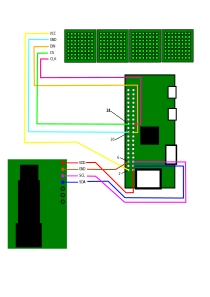

# co2meter

## A Raspberry Pi project to build a CO₂-meter.

We are building a CO₂-meter using 

* a *Raspberry Pi Zero W* single-board minicomputer,
* an LCD display to show the measured values,
* a Sensirion-SCD30 CO₂-sensor to capture the CO₂ values.

## Parts lists

The presented links are not endorsements, just references to the 
type of product that we will use. Buy local!

* **Dot Matrix MAX7219** (4 in 1 Dot Matrix Green) 
  (example brands include AptoFun and Noyito).

* **SCD30**  CO2 SENSOR I2C/MODBUS/PWM DIGITL 
  e.g. https://www.digikey.de/short/m9mfn9f1

* Any **Raspberry Pi**. We will be using a Raspberry Pi Zero W, the
Wifi-version, to avoid the necessity of attaching a monitor and keyboard.

## Operating system installation

We will use the DietPi Linux distribution, install it on a SD-card and connect
to it over the network using SSH.

Follow the installation instructions here: https://dietpi.com/docs/install/

I used 

	wget https://dietpi.com/downloads/images/DietPi_RPi-ARMv6-Bookworm.7z

Extract the image with 

	7z x DietPi_RPi-ARMv6-Bookworm.7z

Write it to your SD-card. 

When writing to the card, make sure to write to the entire card, not only one
of the partitions.

I used

	sudo dd if=DietPi_RPi-ARMv6-Bookworm.img of=/dev/mmcblk0 status=progress bs=1M

Things to note: 

* Be extra careful not to overwrite your harddrive!
* Use **lsblk** to find the name of your SD-card.
* SSH is enabled by default.
* If you don't connect a screen, you need some way to determine the IP-address,
 refer to the dietpi documentation.
* The default *root* user has the default password *dietpi*. 
* The hostname is *dietpi*.

After writing the image file to the SD-card, mount the card and edit 
the files *dietpi.txt* and *dietpi-wifi.txt* to match your setup and network. 
The only entries that I changed were:

In *dietpi-wifi.txt*:

* aWIFI_SSID[0]='MySpecificWifiName'
* aWIFI_KEY[0]='MySuperSecretPassword'

In *dietpi.txt*:

* AUTO_SETUP_KEYBOARD_LAYOUT=de
* AUTO_SETUP_NET_WIFI_ENABLED=1
* AUTO_SETUP_NET_WIFI_COUNTRY_CODE=DE
* AUTO_SETUP_TIMEZONE=Europe/Berlin

Sync the SD-card and eject.

Boot the Raspberry-Pi by connecting it to power, find it on the network using the methods described
on page https://dietpi.com/docs/install/.

I used

	sudo nmap -sn 192.168.1.0/24

The list of MAC-addresses indicates the vendor *Raspberry Pi Foundation*.

After connecting power, wait a minute for the Pi to boot.

Then connect to it:

	ssh root@dietpi

During first boot we will be guided through a wizard to do some housekeeping.

* Change some software installation password. Select 'Cancel'
* Change password for *root* and *dietpi*. Yes, that's a good idea.
* Disable UART/serial.

Finish the wizard with *Install Software minimal image*.

After reboot, re-connect to it:

	ssh root@dietpi

If this doesn't work immediately, use the IP-identification tipps on the
DietPi website.

# Wiring Diagram for entire setup

# MAX7219 Display Details

## Wiring

| Board Pin  | Name  | Remarks  | RPi Pin  | RPi Function | 
|------------|-------|----------|----------|--------------|
| 1  | VCC  | +5V Power  | 2  | 5V0
| 2  | GND  | Ground  | 20  | GND
| 3  | DIN  | Data In  | 19  | GPIO 10 (MOSI)
| 4  | CS  | Chip Select  | 24  | GPIO 8 (SPI CE0)
| 5  | CLK  | Clock  | 23  | GPIO 11 (SPI CLK)

References: 

* https://dietpi.com/forum/t/running-an-led-dot-matrix-8x32-max7219-on-diet-pi/5518
* https://max7219.readthedocs.io/en/0.2.3/

# The CO2-reader SCD30 Details

## Wiring

Connect the CO₂-sensor to the Raspberry Pi.

| SCD30  |  RPi   |
|--------|--------|
| VNN 1  |  1 3.3V 
| GND 2  |  6 GND
| SCL 3  |  5 SCL / GPIO 3 
| SDA 4  |  3 SDA / GPIO 2

References: 

* https://www.raspberrypi.com/documentation/computers/images/GPIO-Pinout-Diagram-2.png
* https://developer.sensirion.com/images/sensirion-tutorial-sensirionblegadget-1-6f.jpg

---

## Software 

Download and run the shell script to do everything that is documented below.

	sh <(curl -L https://raw.githubusercontent.com/StefanSchroeder/co2meter/main/install.sh)

Don't trust my word blindly. Read the code.

After the installation, run **reboot** to start.

We are all set!

The remaining chapters document what's going on behind the scenes.

## Walkthrough 

This section is a deep-dive and explains 
what install.sh does. Use it for debugging.

Run *dietpi-config*.

Go to *Advanced-options*.

	Enable *I2C state* from Off to On.

	Enable *SPI state* from Off to On.

Proceed to install the 'minimal-image'.

Then we install a few standard tools.

	apt install vim git build-essential

Visit the Github project

	https://github.com/Sensirion/raspberry-pi-i2c-scd30

and follow the installation instructions, which are essentially:

	git clone https://github.com/Sensirion/raspberry-pi-i2c-scd30
	cd rasp*
	make

Now running

	root@DietPi:~/raspberry-pi-i2c-scd30# ./scd30_i2c_example_usage

Should yield:

	co2_concentration: 540.31 temperature: 24.19 humidity: 48.64 
	co2_concentration: 549.35 temperature: 24.19 humidity: 48.60 
	co2_concentration: 553.16 temperature: 24.20 humidity: 48.59 
	co2_concentration: 545.07 temperature: 24.20 humidity: 48.57

for a couple of screens.

We are using this example program as a starting point for our sensor recorder.
We'll patch the example to 

* run longer,
* pause between two readings.

We install a service to make sure that the service is started upon reboot.

We enable and start the service.

	systemctl enable scd30readshow.service 
	
